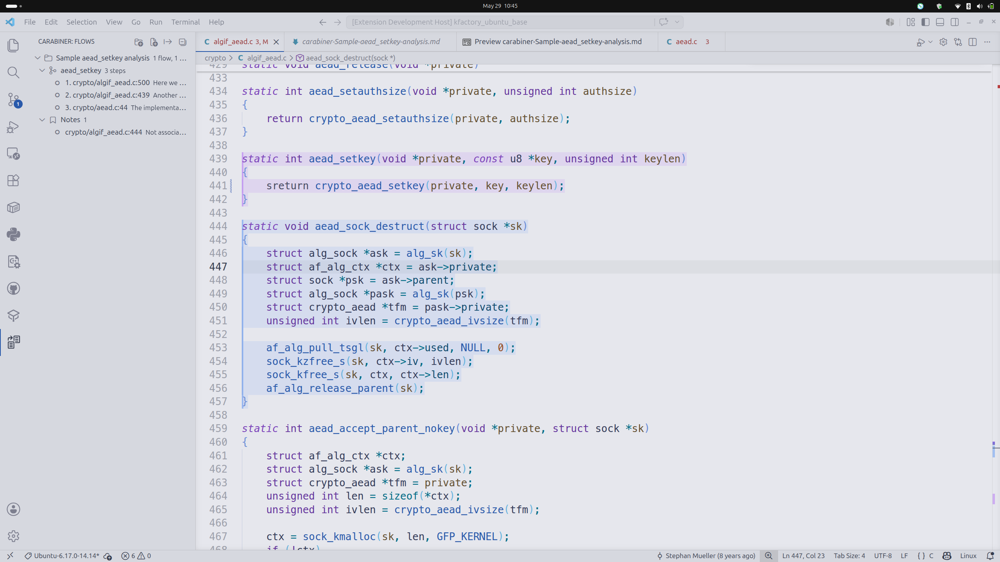
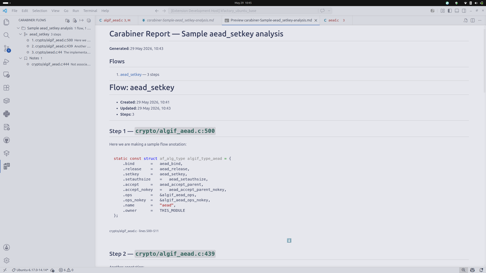

# Carabiner

A VS Code extension for annotating code paths, tracing execution flows, and exporting structured Markdown reports. Built for PR reviews, vulnerability research, and any situation where you need to follow code across multiple files and keep that mental map alive.



## Why

When reviewing a PR or doing static analysis (OSWE, bug bounty, audit), you trace paths through multiple files: "user input enters here → passes through this function → reaches this sink." That mental map evaporates when you switch context. Carabiner makes it persistent.

## Concepts

| Concept | What it is |
|---------|-----------|
| **Note** | A freeform observation pinned to a code selection. Lives independently (not part of any flow). |
| **Flow** | An ordered sequence of annotated steps tracing a code path across files. |
| **Project** | An optional named container that groups related flows and notes (e.g. a CVE, a PR, a pentest target). |

## Getting started

### 1. Add a note

Select code, then:
- Right-click → **Carabiner: Add Selection as Note**
- `Ctrl+Shift+A` / `Cmd+Shift+A`

A Markdown editor opens beside your code, pre-filled with the selected snippet. Write your observation above it, then press `Ctrl+Enter` (or click **✓ Confirm** in the status bar) to save.

If you have projects set up, you'll be prompted to assign the note to one.

### 2. Trace a flow

Select code, then use **Carabiner: Add Annotation to Flow** (`Ctrl+Shift+F`) to create a step and add it to a flow in one action. Repeat across files to build up the full execution path.

Manage flows in the **Carabiner** sidebar panel:
- Drag steps up/down with the ↑↓ inline buttons
- Right-click a flow → Set description, rename, delete, move to project, export

### 3. Organise with projects

Create a project via the command palette: **Carabiner: Create Project**.

Projects appear as folder nodes in the sidebar. When you create a flow or add a note, you'll be asked which project to assign it to (or skip to leave it unassigned).

Use projects to separate contexts — one per PR, one per CVE, one per pentest engagement.

### 4. Export to Markdown

Right-click a flow → **Export Flow to Markdown**, or use **Export All** from the toolbar or command palette.

When exporting all, if you have projects you'll be asked for the scope:
- **All projects** — a single report covering everything, organised by project (unassigned items in a separate section)
- **A specific project** — a focused report for just that project's flows and notes

After choosing the scope, pick what to do with the output:
- **Save to `.carabiner/`** — writes a `.md` file in your repo
- **Copy to clipboard** — paste into PR comments, GitHub issues, Obsidian, etc.



## Sidebar tree structure

```
📁 CVE-2024-1234
  🔀 SQL Injection via search endpoint
     ├── 1. src/routes/search.py:42   "Input extracted without..."
     ├── 2. src/services/search.py:18  "Passed to DB layer"
     └── 3. src/db/queries.py:91      "SQLi sink"
  📝 Notes (2)
     └── src/config/db.py:5

📁 PR Review #42
  🔀 Race condition in worker queue
     └── ...

🔀 Unassigned flow
📝 Unassigned notes (1)
```

## Editor highlights

| Colour | Meaning |
|--------|---------|
| Purple | Annotation referenced in at least one flow |
| Blue | Loose note (not in any flow) |

Hover over a highlight to see the comment inline.

## Data storage

All data lives in `.carabiner/data.json` at your workspace root. You can:
- **Commit it** to share annotations with your team (great for PR reviews)
- **`.gitignore` it** for private notes
- **Export to Markdown** for permanent documentation

The JSON format is simple and human-readable — easy to diff in PRs.

## Keybindings

| Action | Shortcut |
|--------|----------|
| Add note | `Ctrl+Shift+A` / `Cmd+Shift+A` |
| Add annotation to flow | `Ctrl+Shift+F` / `Cmd+Shift+F` |
| Confirm annotation input | `Ctrl+Enter` / `Cmd+Enter` |

## Commands (command palette)

| Command | Description |
|---------|-------------|
| Carabiner: Add Selection as Note | Pin a note to the selected code |
| Carabiner: Add Annotation to Flow | Add a step to an existing flow |
| Carabiner: Create New Flow | Create a flow (optionally assign to a project) |
| Carabiner: Create Project | Create a new project container |
| Carabiner: Rename Project | Rename an existing project |
| Carabiner: Delete Project | Delete project (flows/notes become unassigned) |
| Carabiner: Move Flow to Project | Re-assign a flow to a different project |
| Carabiner: Move Note to Project | Re-assign a note to a different project |
| Carabiner: Export Flow to Markdown | Export a single flow |
| Carabiner: Export All to Markdown | Export all or a specific project (scope picker) |

## Install from source

```bash
git clone https://github.com/josetapadas/Carabiner
cd carabiner-annotator
npm install
npm run compile
# Press F5 in VS Code to run in Extension Development Host
```

## Package as .vsix

```bash
npx @vscode/vsce package --no-dependencies
```

Then install via **Extensions → ··· → Install from VSIX**.

